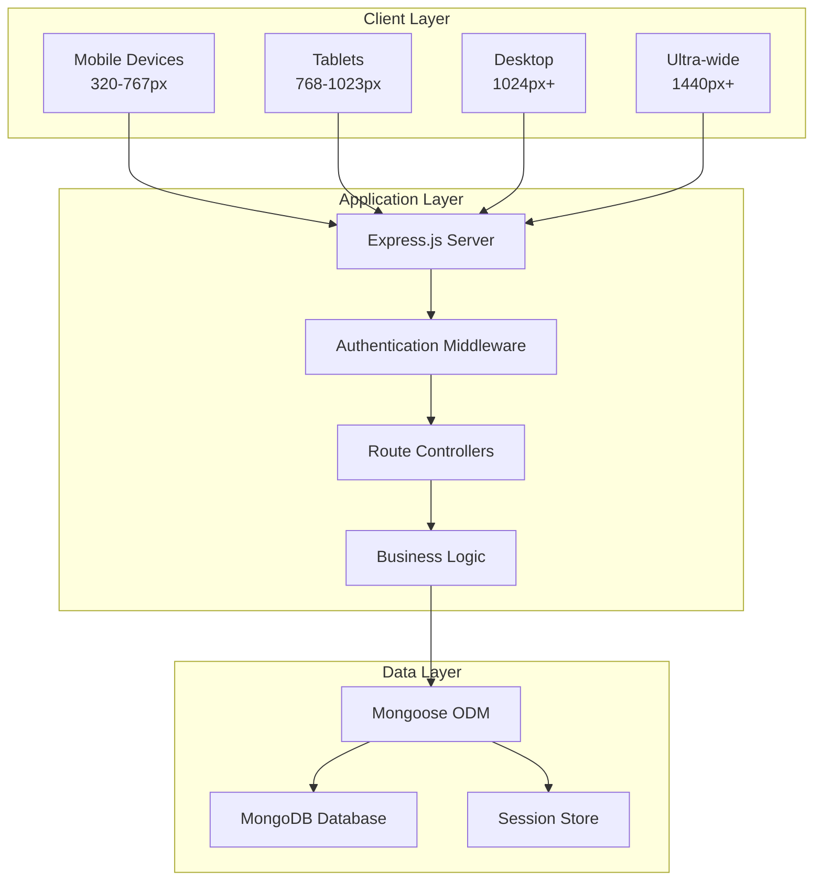
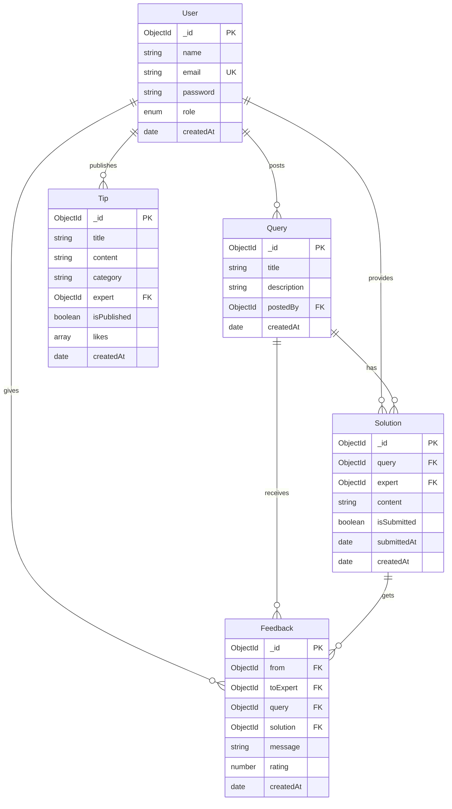

# Health Diet Consultation Platform 🍃

> A comprehensive web application connecting users with certified diet experts for professional health consultations, solutions, and wellness guidance.

[](https://nodejs.org/)
[](https://mongodb.com/)
[](https://expressjs.com/)
[](LICENSE)

## 🎯 Overview

The Health Diet Consultation Platform is a modern, full-stack web application that bridges the gap between health-conscious individuals and certified nutrition experts. Built with Node.js and MongoDB, it provides a secure, responsive platform for diet consultations, expert solutions, and health education.

### 🌟 Key Features

- **🔐 Secure Authentication** - Role-based access with bcrypt password encryption
- **💬 Query & Solution System** - Users post diet questions, experts provide professional answers  
- **📊 Feedback & Rating** - Comprehensive feedback system with 5-star ratings
- **📝 Health Tips** - Expert-published wellness content with like system
- **📱 Mobile Responsive** - Optimized for all devices with mobile-first design
- **🎨 Modern UI/UX** - Professional interface with smooth animations
- **⚡ Real-time Status** - Draft/submitted solution management
- **🛡️ Enterprise Security** - Helmet.js security headers and input validation

---

## 🏗️ Architecture Overview

### Technology Stack

| Layer | Technology | Purpose |
|-------|------------|---------|
| **Frontend** | EJS Templates + Custom CSS | Server-side rendering with responsive design |
| **Backend** | Node.js + Express.js | RESTful API with MVC architecture |
| **Database** | MongoDB + Mongoose | Document-based data storage with ODM |
| **Authentication** | Express-session + bcrypt | Secure session management |
| **Security** | Helmet.js + Validators | Protection against common vulnerabilities |

### System Architecture Diagram



---

## 🚀 Quick Start

### Prerequisites

Ensure you have the following installed:
- **Node.js** (v16.0.0 or higher)
- **MongoDB** (v4.4 or higher)
- **npm** or **yarn** package manager

### Installation

1. **Clone the Repository**
   ```bash
   git clone https://github.com/your-username/health-diet-platform.git
   cd health-diet-platform
   ```

2. **Install Dependencies**
   ```bash
   npm install
   ```

3. **Environment Configuration**
   ```bash
   cp .env.example .env
   ```
   
   Update your `.env` file:
   ```env
   # Database Configuration
   MONGODB_URI=mongodb://localhost:27017/health-diet-app
   
   # Security
   SESSION_SECRET=your-cryptographically-secure-secret-key
   
   # Server Configuration
   PORT=3000
   NODE_ENV=development
   ```

4. **Start the Application**
   ```bash
   # Development mode with auto-reload
   npm run dev
   
   # Production mode
   npm start
   ```

5. **Access the Application**
   Open your browser and navigate to `http://localhost:3000`

---

## 📁 Project Structure

```
health-diet-platform/
├── 📄 app.js                 # Application entry point
├── 📄 package.json          # Dependencies and scripts
├── 📄 .env                  # Environment variables
│
├── 📂 controllers/          # Business logic layer
│   ├── authController.js    # Authentication operations
│   ├── expertController.js  # Expert functionality
│   └── userController.js    # User operations
│
├── 📂 middleware/           # Custom middleware
│   └── auth.js             # Authentication guards
│
├── 📂 models/              # MongoDB schemas
│   ├── User.js            # User account schema
│   ├── Query.js           # Diet query schema
│   ├── Solution.js        # Expert solution schema
│   ├── Feedback.js        # Rating & feedback schema
│   └── Tip.js             # Health tip schema
│
├── 📂 routes/              # Express route definitions
│   ├── auth.js            # Authentication routes
│   ├── user.js            # User-specific routes
│   └── expert.js          # Expert-specific routes
│
├── 📂 views/               # EJS template files
│   ├── layout.ejs         # Main layout template
│   ├── index.ejs          # Homepage
│   ├── auth/              # Authentication pages
│   ├── user/              # User dashboard pages
│   └── expert/            # Expert dashboard pages
│
└── 📂 public/              # Static assets
    ├── 📂 css/            # Stylesheet modules
    ├── 📂 js/             # Client-side JavaScript
    └── 📂 svg/            # Scalable vector icons
```

---

## 🗄️ Database Schema

### Entity Relationship Overview



---

## 🔗 API Reference

### Authentication Endpoints

| Method | Endpoint | Description | Request Body |
|--------|----------|-------------|--------------|
| `POST` | `/auth/register` | Create new user account | `{name, email, password, role?}` |
| `POST` | `/auth/login` | Authenticate user | `{email, password}` |
| `POST` | `/auth/logout` | End user session | None |

### User Endpoints

| Method | Endpoint | Description | Access |
|--------|----------|-------------|--------|
| `GET` | `/user/profile` | View user profile | Authenticated Users |
| `GET` | `/user/queries` | List user's queries | Authenticated Users |
| `POST` | `/user/queries` | Create new query | Authenticated Users |
| `GET` | `/user/solutions` | View received solutions | Authenticated Users |
| `POST` | `/user/feedback` | Submit feedback | Authenticated Users |

### Expert Endpoints

| Method | Endpoint | Description | Access |
|--------|----------|-------------|--------|
| `GET` | `/expert/dashboard` | Expert dashboard | Experts Only |
| `POST` | `/expert/solutions` | Submit solution | Experts Only |
| `GET` | `/expert/solutions` | Manage solutions | Experts Only |
| `POST` | `/expert/tips` | Publish health tip | Experts Only |
| `GET` | `/expert/feedback` | View feedback received | Experts Only |

---

## 🔒 Security Features

### Authentication & Authorization
- **Password Security**: bcrypt hashing with configurable salt rounds
- **Session Management**: MongoDB-backed sessions with TTL
- **Role-Based Access**: User and Expert role separation
- **Route Protection**: Middleware-based authentication guards

### Input Validation & Sanitization
- **Server-Side Validation**: Express-validator for all inputs
- **XSS Protection**: HTML sanitization and encoding
- **SQL Injection Prevention**: Mongoose ODM protection
- **CSRF Protection**: Built-in request verification

### Security Headers
```javascript
// Implemented security headers via Helmet.js
{
  contentSecurityPolicy: true,
  crossOriginEmbedderPolicy: true,
  crossOriginOpenerPolicy: true,
  crossOriginResourcePolicy: true,
  hsts: true,
  noSniff: true,
  frameguard: true
}
```

---

## 📱 Responsive Design

### Mobile-First Approach

Our responsive design ensures optimal user experience across all devices:

| Breakpoint | Device Type | Design Focus |
|------------|-------------|--------------|
| `320px - 767px` | Mobile Phones | Touch-friendly, single column |
| `768px - 1023px` | Tablets | Balanced layout, readable text |
| `1024px - 1439px` | Desktop | Multi-column, enhanced interactions |
| `1440px+` | Ultra-wide | Maximized screen real estate |

### Key Responsive Features
- **Touch-Friendly**: 44px minimum touch targets for iOS compliance
- **Readable Typography**: Fluid typography scaling
- **Optimized Images**: SVG icons for crisp display at any resolution
- **Smooth Animations**: CSS transitions optimized for mobile performance

---

## 🎨 CSS Architecture

### Modular Stylesheet Organization

```
public/css/
├── style.css        # Base typography and design tokens
├── layout.css       # Grid system and layout components  
├── components.css   # Reusable UI components
├── animations.css   # Transitions and micro-interactions
├── pages.css        # Page-specific styling
└── mobile.css       # Mobile-specific responsive behavior
```

### Design System
- **Color Palette**: Consistent health-focused color scheme
- **Typography**: Readable font hierarchy with web-safe fonts
- **Spacing**: 8px grid system for consistent spacing
- **Components**: Reusable button, form, and card components

---

## ⚡ Performance Optimization

### Backend Optimizations
- **Database Indexing**: Strategic indexes on frequently queried fields
- **Query Optimization**: Mongoose population with field selection
- **Session Caching**: MongoDB session store with TTL
- **Error Handling**: Comprehensive try-catch blocks

### Frontend Optimizations
- **Asset Minification**: Compressed CSS and JavaScript
- **SVG Icons**: Scalable vector graphics for performance
- **Lazy Loading**: Progressive content loading
- **Browser Caching**: Optimized cache headers for static assets

### Database Performance
```javascript
// Example: Optimized query with population
const queries = await Query.find({ postedBy: userId })
  .populate('solutions', 'content isSubmitted expert')
  .populate('postedBy', 'name')
  .sort({ createdAt: -1 })
  .limit(10);
```

---

## 🧪 Testing & Quality Assurance

### Manual Testing Coverage
- **Cross-Browser**: Chrome, Firefox, Safari, Edge
- **Mobile Devices**: iOS Safari, Chrome Mobile, Samsung Browser  
- **Accessibility**: ARIA labels, keyboard navigation, screen reader compatibility
- **Performance**: Page load times, responsive behavior testing

### Code Quality Standards
- **ESLint Integration**: Consistent coding standards
- **Error Handling**: Comprehensive error catching and user feedback
- **Input Validation**: Both client-side and server-side validation
- **Security Testing**: Authentication flows and data protection

---

## 🚢 Deployment Guide

### Environment Setup

#### Development Environment
```bash
# Install dependencies
npm install

# Setup environment variables
cp .env.example .env

# Start MongoDB locally
mongod --dbpath /path/to/db

# Run development server
npm run dev
```

#### Production Environment
```bash
# Install production dependencies only
npm ci --only=production

# Set production environment variables
export NODE_ENV=production
export MONGODB_URI=your-production-mongodb-uri
export SESSION_SECRET=your-secure-session-secret

# Start production server
npm start
```

### Deployment Checklist

- [ ] MongoDB connection string configured
- [ ] Session secret is cryptographically secure (32+ characters)
- [ ] Environment variables set correctly
- [ ] Database indexes created
- [ ] HTTPS enabled (handled by hosting platform)
- [ ] Error logging configured
- [ ] Static assets optimized

### Recommended Hosting Platforms
- **Backend**: Heroku, Railway, DigitalOcean App Platform
- **Database**: MongoDB Atlas, DigitalOcean Managed MongoDB
- **CDN**: Cloudflare (for static assets)

---

## 🔧 Development Guide

### Getting Started with Development

1. **Fork and Clone**
   ```bash
   git fork https://github.com/original-repo/health-diet-platform.git
   git clone https://github.com/your-username/health-diet-platform.git
   ```

2. **Development Workflow**
   ```bash
   # Create feature branch
   git checkout -b feature/your-feature-name
   
   # Make changes and test
   npm run dev
   
   # Commit changes
   git add .
   git commit -m "feat: add your feature description"
   
   # Push to your fork
   git push origin feature/your-feature-name
   ```

### Code Style Guidelines

#### Backend Code Pattern
```javascript
// Controller function example
exports.createQuery = async (req, res) => {
  try {
    // Input validation
    const errors = validationResult(req);
    if (!errors.isEmpty()) {
      return res.status(400).render('postQuery', { 
        errors: errors.array(),
        user: req.session.user 
      });
    }
    
    // Business logic
    const { title, description } = req.body;
    const query = new Query({
      title,
      description,
      postedBy: req.session.user._id
    });
    
    await query.save();
    
    // Success response
    res.redirect('/user/queries');
    
  } catch (error) {
    console.error('Error creating query:', error);
    res.status(500).render('error', { 
      message: 'Server error occurred' 
    });
  }
};
```

#### Frontend JavaScript Pattern
```javascript
// Form validation with error handling
async function submitForm(formId, endpoint) {
  try {
    const form = document.getElementById(formId);
    const formData = new FormData(form);
    
    // Client-side validation
    const errors = validateFormData(formData);
    if (errors.length > 0) {
      displayErrors(errors);
      return;
    }
    
    // Submit to server
    const response = await fetch(endpoint, {
      method: 'POST',
      body: formData
    });
    
    if (response.ok) {
      window.location.href = response.url;
    } else {
      throw new Error('Server responded with error');
    }
    
  } catch (error) {
    displayError('An error occurred. Please try again.');
  }
}
```

---

## 🤝 Contributing

We welcome contributions from the community! Please follow these guidelines:

### How to Contribute

1. **Issues**: Report bugs or suggest features via GitHub Issues
2. **Pull Requests**: Submit PRs for bug fixes or new features
3. **Documentation**: Help improve documentation and guides
4. **Testing**: Test the application and report any issues

### Contribution Guidelines

- Follow the existing code style and patterns
- Write descriptive commit messages
- Test your changes thoroughly
- Update documentation as needed
- Ensure responsive design compatibility

### Development Setup for Contributors

```bash
# Fork the repository on GitHub
# Clone your fork
git clone https://github.com/your-username/health-diet-platform.git

# Install dependencies
npm install

# Create a new branch for your feature
git checkout -b feature/amazing-new-feature

# Make your changes and test them
npm run dev

# Commit and push your changes
git add .
git commit -m "feat: add amazing new feature"
git push origin feature/amazing-new-feature

# Create a Pull Request on GitHub
```

---

## 📚 Additional Resources

### Documentation Links
- [Node.js Documentation](https://nodejs.org/docs/)
- [Express.js Guide](https://expressjs.com/guide/)
- [MongoDB Manual](https://docs.mongodb.com/)
- [Mongoose Documentation](https://mongoosejs.com/docs/)

### Learning Resources
- [EJS Template Engine](https://ejs.co/)
- [CSS Grid Layout](https://css-tricks.com/snippets/css/complete-guide-grid/)
- [Mobile-First Design](https://developer.mozilla.org/docs/Web/Progressive_web_apps/Responsive/Mobile_first)

### Browser Compatibility
- **Modern Browsers**: Chrome 90+, Firefox 88+, Safari 14+, Edge 90+
- **Mobile Support**: iOS Safari 14+, Chrome Mobile 90+, Samsung Internet 13+
- **JavaScript**: ES6+ features with graceful degradation
- **CSS**: Flexbox and Grid with fallback support

---

## 🆘 Troubleshooting

### Common Issues and Solutions

#### Database Connection Issues
```bash
# Check MongoDB is running
sudo systemctl status mongod  # Linux
brew services list | grep mongo  # macOS

# Test connection
mongosh "your-mongodb-uri"

# Check environment variables
echo $MONGODB_URI
```

#### Session Issues
```javascript
// Verify session configuration in app.js
app.use(session({
  secret: process.env.SESSION_SECRET, // Must be set
  store: MongoStore.create({
    mongoUrl: process.env.MONGODB_URI  // Must be valid
  })
}));
```

#### Static File Issues
```bash
# Ensure public folder structure is correct
public/
├── css/
├── js/
└── svg/

# Check Express static middleware
app.use(express.static('public'));
```

### Debug Commands
```bash
# Check Node.js version
node --version

# Verbose logging
DEBUG=* npm start

# Test specific endpoints
curl -X GET http://localhost:3000/api/health-check
```

---

## 📄 License

This project is licensed under the MIT License - see the [LICENSE](LICENSE) file for details.

---

## 🙏 Acknowledgments

- **Express.js Team** - For the robust web framework
- **MongoDB Team** - For the flexible NoSQL database
- **Node.js Community** - For the extensive ecosystem
- **Open Source Contributors** - For making development tools accessible

---

## 📞 Contact & Support

- **GitHub Issues**: [Report bugs or request features](https://github.com/your-username/health-diet-platform/issues)
- **Documentation**: [Visit our wiki](https://github.com/your-username/health-diet-platform/wiki)
- **Email**: support@health-diet-platform.com

---

<div align="center">

**Built with ❤️ for health and wellness**

Made by [Your Team Name] | © 2024 Health Diet Consultation Platform

[⬆ Back to Top](#health-diet-consultation-platform-)

</div>
